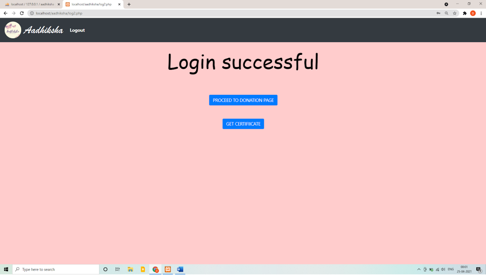

# aadhiksha
A lot of NGOs, orphanages, shelter homes and several other organizations work for our 
society. These organizations are often in search of volunteers to help them with numerous 
jobs. So This project provides a way to help such organisations to ease their work. This 
project has built up a website for such NGOs where they can register their organisations and 
make the process of finding donors and building contacts with them for particular donation 
easier. This website provides a match between donors and organisations based on their 
location and interest and also perform various functionalities.

<h1>screenshots:-</h1>

